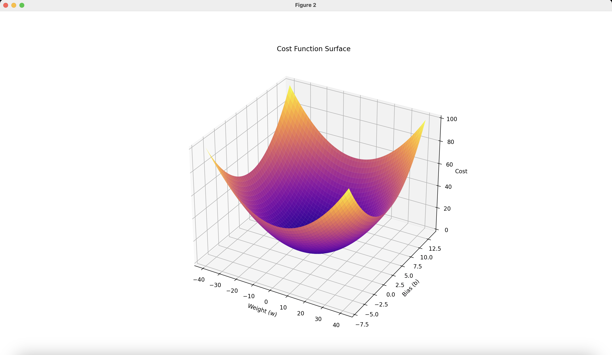
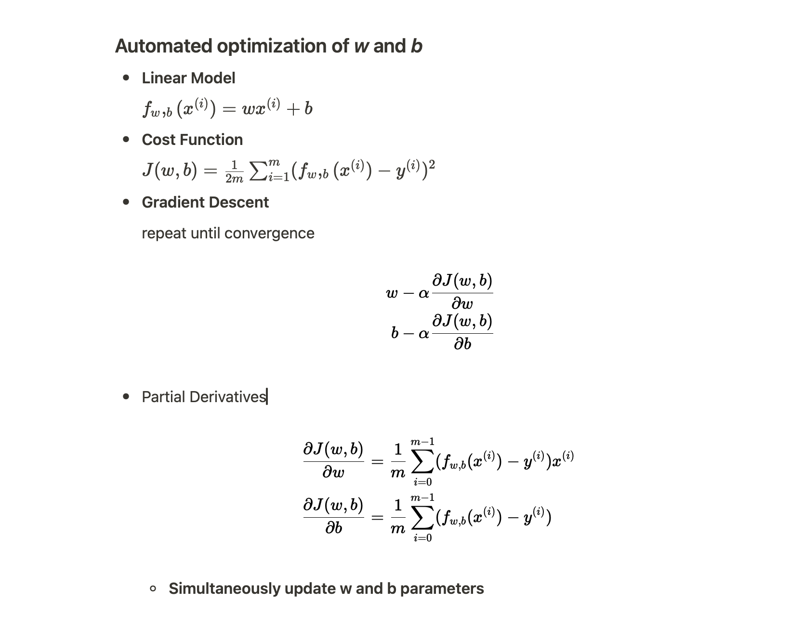
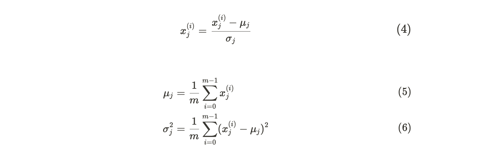

# MACHINE LEARNING

## Supervised Learning

### Linear Regression

- **Linear Model**
    
    $f_w,_b(x^{(i)}) =wx^{(i)} + b$ 
    
- **Cost Function**
    
    $J(w,b) = \frac{1}{2m} \sum_{i=1}^{m} (f_w,_b(x^{(i)}) - y^{(i)})^2$

*Figure 1: Mean Squared Error (MSE) loss function provides a convex loss function, which ensures that there is a single global minimum and no local minima.
    

    

    
    
<em>Figure 2: Gradient Descent In Action</em>

- **Z-sore Normalization**

    - In order to make the contour uniform in all axes and improve efficiency of gradient descend, z score normalization is used.

