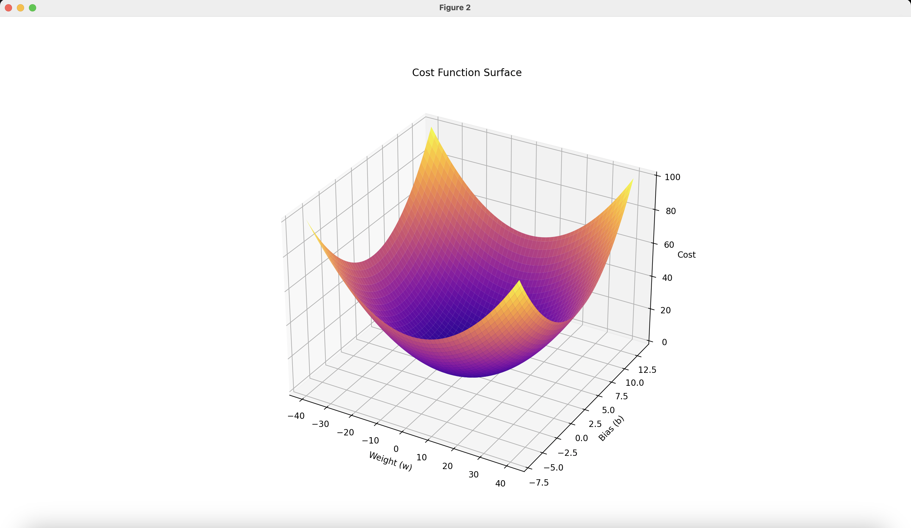

# MACHINE LEARNING

## Supervised Learning

### Linear Regression

- **Linear Model**
    
    $f_w,_b(x^{(i)}) =wx^{(i)} + b$ 
    
- **Cost Function**
    
    $J(w,b) = \frac{1}{2m} \sum_{i=1}^{m} (f_w,_b(x^{(i)}) - y^{(i)})^2$

*Figure 1: Mean Squared Error (MSE) loss function provides a convex loss function, which ensures that there is a single global minimum and no local minima.
    
- **Gradient Descent**
    
    repeat until convergence
    
    $$
    \color{white}\small\begin{align*}
    \; \color{white} {w - \alpha \frac{\partial J(w, b)}{\partial w}}  \\  \color{white} {b - \alpha \frac{\partial J(w, b)}{\partial b}} \\
    \end{align*}
    
    $$
    
- Partial Derivatives
    
    $$
    \color{white}\small
    \begin{align*}
    \frac{\partial J(w,b)}{\partial w} & = \frac{1}{m} \sum\limits_{i = 0}^{m-1} (f_{w,b}(x^{(i)}) - y^{(i)})x^{(i)} \\
    \frac{\partial J(w,b)}{\partial b} & = \frac{1}{m} \sum\limits_{i = 0}^{m-1} (f_{w,b}(x^{(i)}) - y^{(i)})
    \end{align*}
    $$
    
    - **Simultaneously update w and b parameters**

<video controls src="include/imgs/gradient_descend.mp4" title="Title"></video>
*Figure 2: Gradient Descend In Action

- **Z-sore Normalization**

    - In order to make the contour uniform in all axes and improve efficiency of gradient descend, z score normalization is used.
$$
\small x^{(i)}_j = \dfrac{x^{(i)}_j - \mu_j}{\sigma_j} \tag{1}
$$

$$
\small \begin{align}\mu_j &= \frac{1}{m} \sum_{i=0}^{m-1} x^{(i)}_j \tag{2}\\\sigma^2_j &= \frac{1}{m} \sum_{i=0}^{m-1} (x^{(i)}_j - \mu_j)^2  \tag{3}\end{align}
$$
